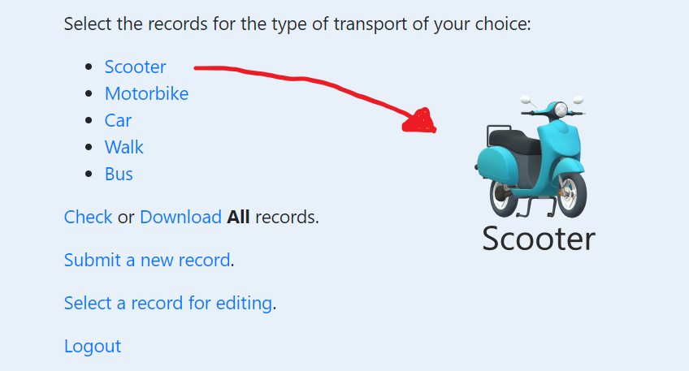
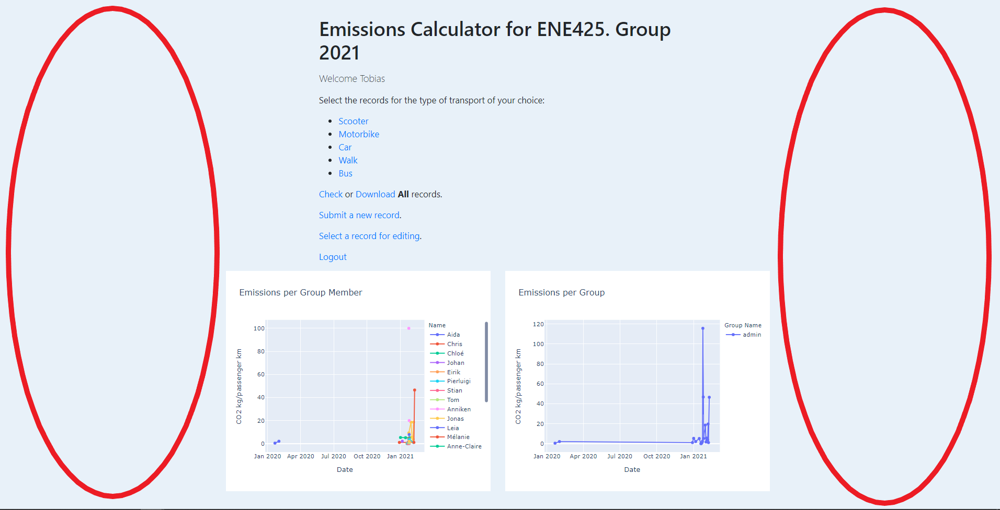

# emissions-calculator-group2

Emissions DB collector for ENE425: [Emissions calculator](http://ene425.gabrielfuentes.org/login?next=%2F)

__Directory Tree:__

                
                +--- Emissions_App
                |   app.py
                |   LICENSE
                |   Procfile
                |   python-app.yml
                |   requirements.txt
                |   tree_output.doc
                |   
                +---notes
                |       .gitkeep
                |       module_design_v2.png
                |       
                +---static
                |       favicon.png
                |       
                \---templates
                        add_record.html
                        edit_or_delete.html
                        error.html
                        index.html
                        list.html
                        login.html
                        result.html
                        select_record.html

## Section 1: App Development Journal

### WEEK 5 - Task 1: Cloud environment
_The App Developement set up the environment. The Diary Team set up the README structure and project management setup.
The Emissions methodology crew start identifying sources and uploaded to diary when accepted in GitHub environment._

### WEEK 6 - Task 2: App Structure
_The App Development Team uploaded repository files  from Gabriel's example repository to structure our own repository. The team also created a directory tree for our repository that is located in this README file.
The diary team updated on the project section.
The Methodology team kept adding methods to the Section 2 in the README file._

### WEEK 7 - Task 3: App design
#### Color suggestions

Background:

468C98

C8D5B9

A1D2CE

7FC6A4

Buttons:

Borders:

#### Possible changes in design:

Suggestion 1 - Add icons for all the vehicles, as shown in the following picture. Line them up horisontally instead of vertically. 
  

Suggestion 2 - Fill in the open space at the left and right side of the calculator. This could be filled with advertisment($$$$) or pictures that doesn't drag attention away from the calculator itself
  

### WEEK 8 - Task 4: App deployment

### WEEK 9 - Task 5: Emissions calculation methodology (responsible diary)

### WEEK 10 - Task 6: App URL Redirection

## Section 2: Different methodologies to calculate CO2 emissions

Here is a list of different methodologies we can use:

1. Methods for calculating the emissions of transport in the Netherlands: [Link to paper](https://english.rvo.nl/sites/default/files/2018/04/Klein-et-al-2018-%20Methods-for-calculating-emissions-transport-Netherlands-2018.pdf)

2. This document presents a general methodology developed for estimating the amount of
carbon emissions (CO2) generated by a passenger in a flight: [Link to paper](https://www.icao.int/environmental-protection/CarbonOffset/Documents/Methodology%20ICAO%20Carbon%20Calculator_v11-2018.pdf)

3. How to calculate CO2 emissions from fuel consumption (typical fuels used in cars and busses): [Link to website](https://ecoscore.be/en/info/ecoscore/co2)

4. CO2 emissions data
[Here](https://ourworldindata.org/grapher/co2-transport-mode?tab=chart&stackMode=absolute&time=latest&country=Domestic%20flight~Eurostar%20(international%20rail)~Medium%20car%20(diesel)~Medium%20car%20(petrol)~Short-haul%20flight%20(economy)~Long-haul%20flight%20(economy)~Motorcycle%20(medium)~National%20rail~Bus~Small%20electric%20vehicle%20(UK%20electricity)&region=World) Under link we can find CO₂ emissions (in grams per passenger kilometer) by mode of transport, 2018 based on data of UK Department for Business, Energy & Industrial Strategy (BEIS). Different modes of transport can be selected. This can serve as a basis, but can at best be supplemented by data for Norway or more up-to-date data.

## Section 3: Questions to Gabriel
Write your question to Gabriel below.
